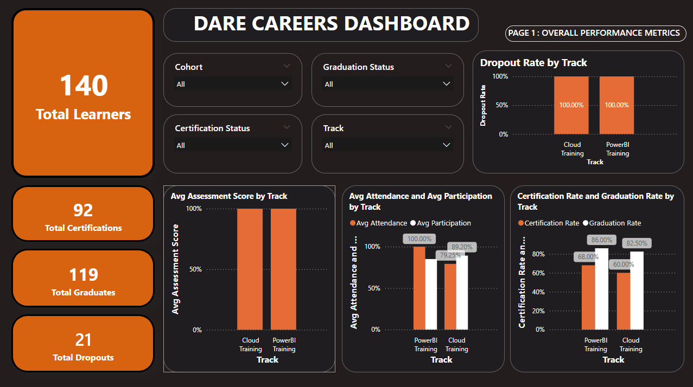
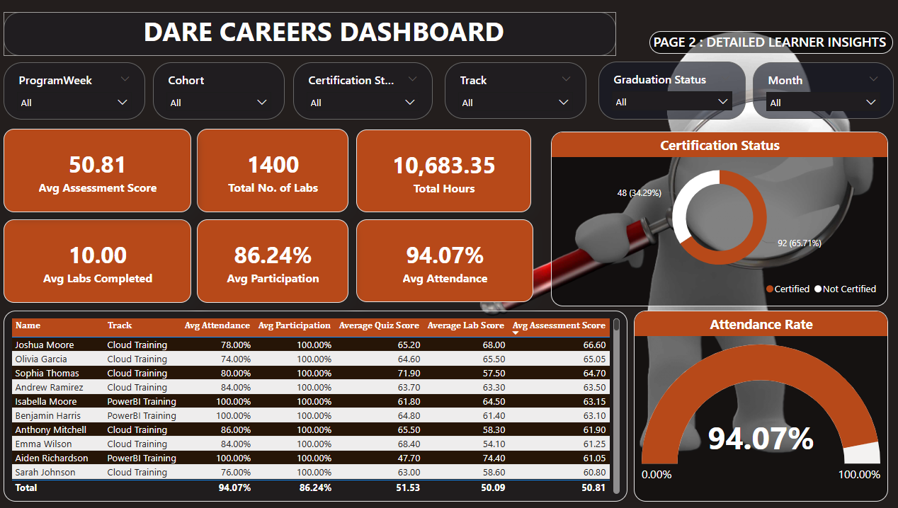

# Power BI Dashboard – Tracking Student Progress & Performance (Dare Careers)

## Project Overview
Dare Careers provides training in **Power BI** and **AWS Cloud**. This project delivers a Power BI dashboard to monitor learner engagement and performance across the 10-week program. The dashboard supports program managers and trainers by showing attendance, participation, assessments (labs/quizzes), and learner outcomes (graduation & certification).

## Objectives
- Track learner **attendance**, **participation**, and **assessment performance** over time.
- Monitor learner outcomes: **graduation**, **certification**, and **dropout/incomplete**.
- Identify performance trends per **Track** and **Cohort**, and drill down to individual learners.

---

## Data Sources & Structure
Data was provided in folders for two tracks:
- **PowerBI Training**
- **Cloud Training**

### Datasets used
1. **Zoom Attendance (Daily)**
   - Stored by track → Week 1 to Week 10 → daily attendance files.
2. **Participation Records (Daily)**
   - Stored by track → daily participation list.
3. **Labs & Quizzes (Weekly)**
   - Stored by track → Week 1 to Week 10 scores.
4. **Status Records**
   - Stored by track → Certification status + Graduation status.

---

## Business Rule Applied
### Attendance Rule
A learner is marked as **Attended** if they spent **more than 30 minutes** in a Zoom session.  
This rule is applied to all attendance calculations (overall and learner-level).

---

## Data Preparation (Power Query)
Key cleaning and transformation steps:
- Combined all attendance files from all weeks and both tracks into one table.
- Standardized columns: **Date**, **Email**, **Name**, **Track**, **Week**, **Duration**, **Attended**.
- Converted duration into a consistent numeric format and created:
  - **Attended flag** (Yes/No or 1/0) based on > 30 minutes.
- Participation data was expanded so each learner per day becomes a row.
- Labs and quizzes were reshaped into a long format (Week, Type, Score).
- Status data was cleaned and standardized (Certified/Not Certified, Graduate/Non Graduate).
- Created **Cohort** column in DimLearner (e.g., “Cohort 1”).

---

## Data Model (Star Schema)
The model follows a star schema with shared dimension tables.

### Dimension Tables
- **DimLearner**
  - Cohort, Email, Name, Track
- **DimDate**
  - Date, Month, ProgramWeek, Weekday

### Fact Tables
- **Fact Attendance**
  - Date, Email, Duration, Attended, Track, Week
- **Fact Participation**
  - Date, Participants/Name, Track
- **Fact Assessments**
  - Assessment Type (Labs/Quiz), Week, Email, Score, Track
- **Fact Status**
  - Email, Certification Status, Graduation Status, Track

### Relationships (Cardinality)
- DimLearner (1) → Fact Attendance (*)
- DimLearner (1) → Fact Assessments (*)
- DimLearner (1) → Fact Status (* or 1)
- DimDate (1) → Fact Attendance (*)
- DimDate (1) → Fact Participation (*)

Note: Participation is linked using learner identity (Name/Email) after standardization.

---

## Key Measures (DAX)
Major metrics implemented include:
- **Total Learners**
- **Total Graduations / Graduation Rate**
- **Total Certifications / Certification Rate**
- **Total Dropouts / Dropout Rate**
- **Average Attendance / Attendance Rate**
- **Average Participation Rate**
- **Average Lab Score**
- **Average Quiz Score**
- **Average Assessment Score**
- **Count of Labs Completed**
- **Average Labs Completed per Learner**
- **Total Hours Spent in Class**

---

## Report Pages

## Page 1: Overall Performance Metrics
Purpose: High-level overview of learner outcomes and engagement.

### Visuals
- Bar charts:
  - Graduation Rate by Track
  - Certification Rate by Track
  - Dropout Rate by Track
  - Average Attendance by Track
  - Average Participation by Track
  - Average Assessment Score by Track
- Cards:
  - Total Learners
  - Total Graduations
  - Total Certifications
  - Total Dropouts

### Filters (Slicers)
- Cohort
- Track
- Certification Status
- Graduation Status

---

## Page 2: Detailed Learner Insights
Purpose: Drill-down view for trainers to see learner-level performance.

### Visuals
- Learner table with:
  - Attendance rate, participation rate, assessment averages, labs completed, hours spent
- Cards:
  - Count of Labs
  - Average Labs Completed
  - Total Hours Spent
  - Average Attendance Rate
  - Average Participation Rate
  - Average Assessment Score

### Filters (Slicers)
- Cohort
- Track
- Month
- Program Week
- Learner Status (Certified / Not Certified)
- Program Status (Completed / Ongoing) if applicable

---

## Assumptions
- **Dropout** is treated as learners who are **Non Graduate / not completed** (based on status data).
- Participation is counted as **1 participation per learner per day** when listed.
- Labs completed are counted when a learner has a **non-blank (or >0) lab score**.

---

## How to Use the Dashboard
1. Use slicers (Track, Cohort, Status) to filter the report.
2. On Page 1, review overall performance and engagement trends.
3. On Page 2, drill down into learner-level metrics to identify learners at risk and support interventions.

---

## Outcome / Value
This dashboard helps Dare Careers to:
- Monitor attendance compliance using the >30 minutes rule.
- Track participation engagement daily.
- Evaluate weekly learning outcomes via labs and quizzes.
- Measure graduation and certification performance by track/cohort.
- Identify learners at risk early using detailed learner insights.

---

## Tools Used
- Power BI Desktop
- Power Query (ETL / Cleaning)
- DAX (Measures)
- Star Schema Data Modelling

---
